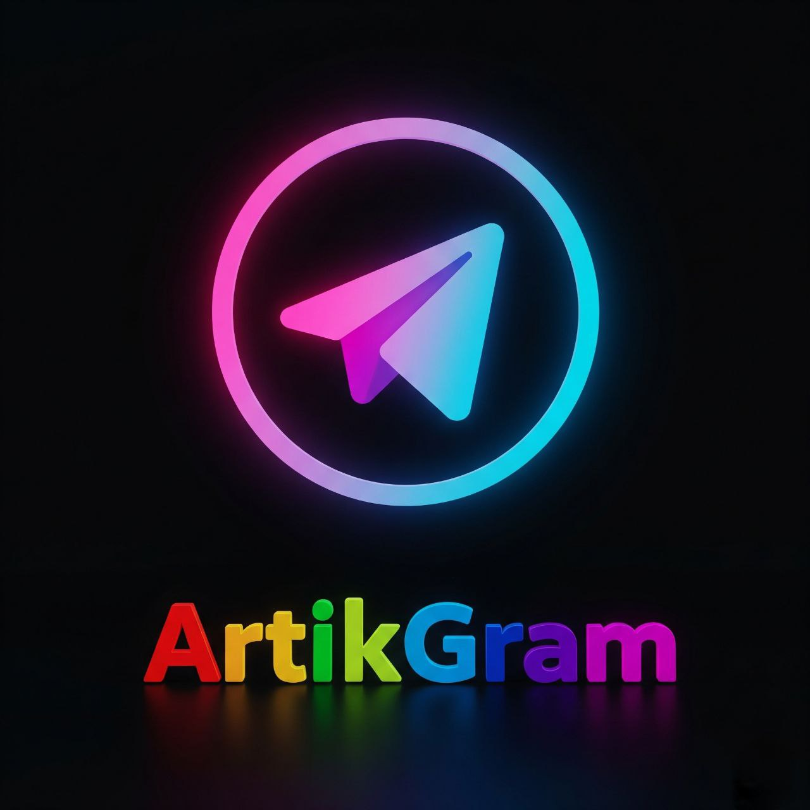

# ArtikGram

  

<h3 align="center">The Next-Generation Telegram Client</h3>

Powered by Python, Kivy, and Artificial Intelligence

  <!-- Замени ссылки ниже, когда появится проект -->
  <a href="https://t.me/artikgram">Telegram Channel</a> •
  <a href="mailto:artembahanov156@gmail.com">Contact Me</a>

---

**⚠️ Important Notice: Project in Early Development**

Hey there! Welcome to the ArtikGram GitHub repository. This is a very ambitious project to create a feature-rich, AI-powered Telegram client from the ground up.

Please be aware that this project is in its **very early stages**. Right now, it's more of a proof-of-concept with a basic UI. A lot of the cool features are in the planning and design phase.

I'm learning as I build, so any help, advice, or encouragement is greatly appreciated!

### 🚧 Current Status

*   **What's working:** A welcome screen and a phone number input prototype (non-functional UI).
*   **What's not working:** Almost everything else! This is a skeleton right now.
*   **Build guide:** Not available yet. I'll write one once there's something substantial to build.

### 🧠 Planned AI-Powered Features (The Dream List)

The ultimate goal for ArtikGram is to integrate cutting-edge AI to make your messaging smarter:
*   **AI Assistant & Chat Summarization**
*   **Advanced Anti-Spam**
*   **Smart Reply & Content Generation**
*   **Voice & Speech Features** (TTS, STT, Voice Changer)
*   **User Analytics & Statistics**
*   ...and much more.

### 👨‍💻 About the Developer

Hi! I'm **Artem** (`@artikruss777`). I'm 12 years old and I'm passionate about programming, AI, and creating cool stuff. This is my first big project, and I'm using it to learn Python, Kivy, Git, and GitHub.

*   **My GitHub journey has just begun.** My repository might be a bit messy as I'm still learning best practices for commits, branches, and documentation. Thank you for your understanding!
*   **I welcome all help!** If you have suggestions on code, architecture, or how to use Git better, please let me know.

### 📬 Contact Me

Have a question, want to follow progress, or just say hi?
*   **Telegram:** [@artikruss777](https://t.me/artikruss777)
*   **Project Channel:** [t.me/artikgram](https://t.me/artikgram)
*   **Email:** [artembahanov156@gmail.com](mailto:artembahanov156@gmail.com)

---

> **Dream big, start small, and learn by doing.**